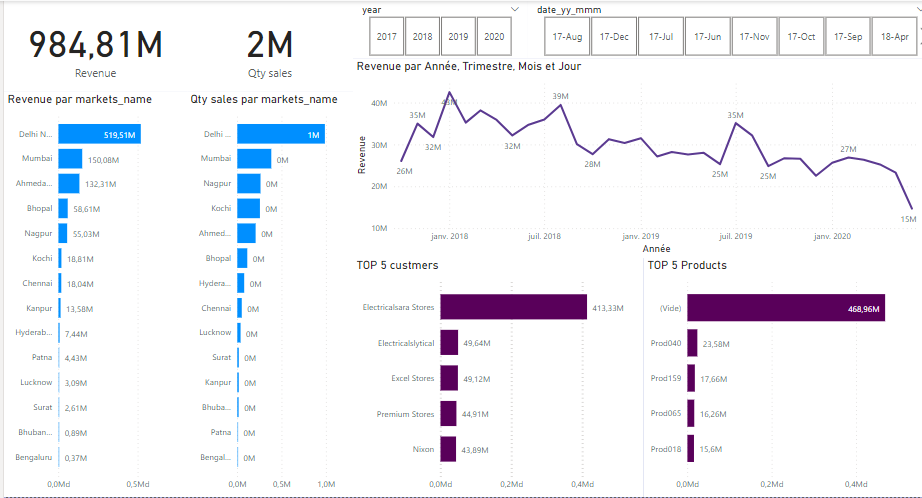

# Sales Insights — Data Analytics

> Power BI dashboard over a MySQL sales database for AtliQ Hardware — turning four years of transactions into decisions the sales director can actually act on.



## The problem

AtliQ Hardware distributes computer hardware and peripherals across India.
Revenue was declining and the sales director had no reliable read on why. Status
came from calling regional managers, who reported from spreadsheets — so the
picture arrived late, filtered through whoever was speaking, and nobody could
compare markets side by side.

Nobody makes good decisions by reading numbers out of Excel over the phone.

## The solution

A Power BI dashboard on top of the sales database, so performance by market,
customer, and product is visible directly, and the underlying numbers are
consistent because everyone reads the same model.

## Stack

| Layer | Tool |
|---|---|
| Source data | MySQL |
| ETL / cleaning | Power Query |
| Modelling & measures | Power BI, DAX |
| Planning | AIMS grid |

## Setup

```bash
mysql -u root -p < db_dump_version_2.sql
```

Then open `Sales Insights Data Analysis.pbix` in Power BI Desktop and point the
MySQL connection at your local database.

| File | Contents |
|---|---|
| `db_dump.sql` | Original database dump |
| `db_dump_version_2.sql` | Revised dump — **use this one** |
| `Sales Insights Data Analysis.pbix` | The Power BI report |
| `Capture.PNG` | Dashboard screenshot |

## Data model

Five tables:

| Table | Holds |
|---|---|
| `transactions` | Sales records — the fact table |
| `customers` | Customer names and types |
| `products` | Product codes and types (Own Brand / Distribution) |
| `markets` | Cities and zones |
| `date` | Date dimension for time intelligence |

## Process

1. Plan with the **AIMS grid** (Aim, Issue, Measure, Success criteria).
2. Connect Power BI to MySQL and pull the tables.
3. Clean in **Power Query** — drop nulls and negative-value rows.
4. **Normalise currency.** Transactions arrived in two currencies; everything is
   converted to a single one before aggregation. Without this every revenue
   figure is silently wrong.
5. Build **DAX measures** for revenue, profit margin, and contribution %.
6. Validate against known totals.
7. Model relationships and build the visuals.

### Fixes applied to the source data

- **The `(blank)` products problem.** The original `products` table was missing
  Prod280–Prod339, so those transactions aggregated into a blank category.
  Replaced with a completed table that includes them, each assigned a product
  type.
- **Merged transaction tables** so profit margin and cost price are available
  alongside the original sales columns — profitability analysis isn't possible
  without them.

## Findings

Four years, ₹985M revenue, ₹24.7M profit, **2.5% overall margin**, 2M units.

**Revenue and profit don't track each other.** That's the headline:

| Market | Revenue | Margin |
|---|---|---|
| Delhi NCR | ₹520M (52.8% of total) | **2.3%** — below company average |
| Mumbai | — | 23.89% of total *profit* |
| Bhubaneshwar | — | **10.48%** — highest margin (2020) |
| Bengaluru | — | **−20.8%** — loss-making, −0.3% profit contribution |

Delhi NCR is over half of all revenue at a below-average margin, while Mumbai
contributes nearly a quarter of profit on far less revenue. Ranking markets by
revenue — the intuitive move — points management at exactly the wrong places.
Bengaluru actively destroys value.

**Concentration risk.** Electricalsara Stores alone accounts for ₹413M of ₹985M
— 42% of revenue in one customer.

**Product mix.** Distribution and Own Brand each generated ~₹494M, an even
split. Prod318 is the top product at ₹69M.

**Timeline.** 2020 revenue was ₹142M on 350K units for ₹2.1M profit. Revenue
dropped sharply in June 2020, and margin bottomed in April 2020.

## Key learnings

- What real business data actually looks like — incomplete dimension tables,
  mixed currencies, and negative values that need handling before anything else.
- Writing analysis queries in MySQL.
- Connecting MySQL to Power BI, and cleaning in Power Query.
- Practical DAX measures.
- Choosing visuals that answer a question rather than just displaying data.

## Credit

Based on the AtliQ Hardware case study from Codebasics.
